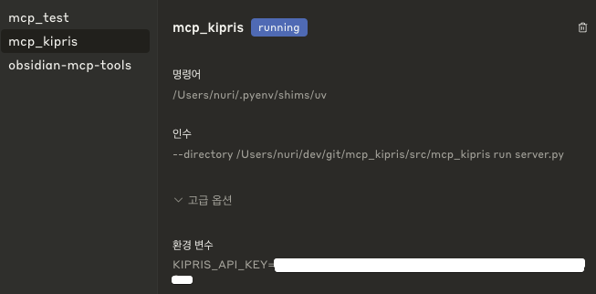

# MCP KIPRIS

[](https://github.com/nuri428/mcp_kipris/actions/workflows/test.yml)
[](https://codecov.io/gh/nuri428/mcp_kipris)
[](https://www.python.org)
[](https://opensource.org/licenses/MIT)

[English →](README.md) | **한국어**

KIPRIS(한국특허정보원) API를 활용한 특허 검색 도구입니다. AI 어시스턴트(Claude 등)가 한국 및 해외 특허를 검색할 수 있도록 [Model Context Protocol (MCP)](https://modelcontextprotocol.io) 서버를 제공합니다.

---

## 기능

### 한국 특허 검색
| 도구명 | 설명 |
|--------|------|
| `patent_applicant_search` | 출원인 이름으로 특허 검색 |
| `patent_keyword_search` | 자유 텍스트(키워드)로 특허 검색 |
| `patent_application_number_search` | 출원번호로 특허 검색 |
| `patent_righter_search` | 권리자 이름으로 특허 검색 |
| `patent_detail_search` | 출원번호로 특허 상세 정보 조회 |
| `patent_summary_search` | 출원번호로 특허 요약 정보 조회 |
| `abstract_search` | 초록(발명의 개요)으로 특허 검색 — *[@haseo-ai](https://github.com/haseo-ai) 기여* |
| `ipc_search` | IPC 코드로 특허 검색 — *[@haseo-ai](https://github.com/haseo-ai) 기여* |
| `agent_search` | 대리인명으로 특허 검색 — *[@haseo-ai](https://github.com/haseo-ai) 기여* |

### 상표 검색
| 도구명 | 설명 |
|--------|------|
| `trademark_search` | 키워드로 한국 상표 검색 — *[@haseo-ai](https://github.com/haseo-ai) 기여* |

### 해외 특허 검색
| 도구명 | 설명 |
|--------|------|
| `foreign_patent_applicant_search` | 출원인 이름으로 해외 특허 검색 |
| `foreign_patent_application_number_search` | 출원번호로 해외 특허 검색 |
| `foreign_patent_free_search` | 자유 텍스트로 해외 특허 검색 |
| `foreign_patent_international_application_number_search` | 국제출원번호로 해외 특허 검색 |
| `foreign_patent_international_open_number_search` | 국제공개번호로 해외 특허 검색 |

---

## 요구사항

- Python 3.11 이상
- [KIPRIS Open API 키](https://plus.kipris.or.kr) (무료 회원가입 필요)

---

## 설치

### 방법 1: PyPI에서 설치 (권장)

```bash
pip install mcp-kipris
```

> PyPI 배포 이후 사용 가능합니다. 배포 전이라면 방법 2(소스 설치)를 사용하세요.

### 방법 2: 소스에서 설치 (개발용)

```bash
git clone https://github.com/nuri428/mcp_kipris.git
cd mcp_kipris

# uv 사용 (권장)
uv sync

# 또는 pip 사용
pip install -e .
```

### 환경 설정

서버 실행 전 KIPRIS API 키를 설정해야 합니다:

```bash
export KIPRIS_API_KEY="your_api_key_here"
# 또는 프로젝트 루트 또는 src/ 디렉토리에 .env 파일로 설정
```

---

## 서버 실행 방법

### stdio 모드 — MCP 클라이언트(Claude Desktop 등)용

```bash
# CLI 진입점 사용
mcp-kipris

# 또는 uv를 통해
uv run python -m mcp_kipris.server
```

### HTTP / SSE 모드 — 웹 기반 MCP 클라이언트용

```bash
uv run python -m mcp_kipris.sse_server --http --port 6274 --host 0.0.0.0
```

### mcpo 프록시 사용 (stdio → HTTP 브리지)

```bash
uvx mcpo --port 6274 -- uv run python -m mcp_kipris.server
```

### Docker

```bash
bash sse_server_build.sh
```

---

## Claude Desktop 설정

Claude Desktop의 `claude_desktop_config.json`에 다음을 추가하세요:

```json
{
  "mcpServers": {
    "kipris": {
      "command": "uv",
      "args": ["run", "python", "-m", "mcp_kipris.server"],
      "env": {
        "KIPRIS_API_KEY": "your_api_key_here"
      }
    }
  }
}
```



---

## 테스트

### 로컬 테스트 실행

테스트는 실제 API를 호출하므로 유효한 `KIPRIS_API_KEY`가 필요합니다.

```bash
# 개발 의존성 설치 (uv 사용)
uv sync --group dev

# 커버리지와 함께 전체 테스트 실행
pytest test/ -v --cov=src/mcp_kipris --cov-report=term-missing

# 개별 테스트 파일 실행
python test/test_samsung_patents.py
python test/test_patent_keyword_search.py
```

### 린트 및 포맷 검사

```bash
ruff check src/
ruff format src/
```

### Python 배포판 테스트

릴리즈 전 패키지가 올바르게 빌드되고 설치되는지 검증합니다:

```bash
# 1. 배포판 빌드
pip install build
python -m build

# 2. 깨끗한 가상환경에 wheel 설치 후 동작 확인
python -m venv /tmp/kipris-test-env
source /tmp/kipris-test-env/bin/activate
pip install dist/mcp_kipris-*.whl
python -c "import mcp_kipris; print('OK')"
deactivate

# 3. Editable 설치 테스트 (개발 워크플로우)
pip install -e .
pytest test/ -v
```

### CI 매트릭스

CI 파이프라인은 `main` / `develop` 브랜치의 모든 push 및 PR에서 **Python 3.11과 3.12**로 실행됩니다:

| 단계 | 도구 | 상세 |
|------|------|------|
| 린트 | `ruff check` | PEP 8 + 스타일 규칙 |
| 포맷 | `ruff format --check` | 일관된 코드 포맷 |
| 테스트 | `pytest` | 실제 API 호출 + 커버리지 |
| 커버리지 | Codecov | Python 3.12 실행 결과 업로드 |

---

## API 사용 예제

### 1. 출원인 검색 (삼성전자 최신 특허 5건)

```bash
curl -X POST "http://localhost:6274/messages/?session_id=<세션_ID>" \
  -H "Content-Type: application/json" \
  -d '{
    "type": "tool",
    "name": "patent_applicant_search",
    "args": {
      "applicant": "삼성전자",
      "docs_count": 5,
      "desc_sort": true
    }
  }'
```

### 2. 도구 목록 조회

```bash
curl http://localhost:6274/tools | jq .
```

### 3. SSE 세션 ID 발급

```bash
curl -N http://localhost:6274/messages/
# 응답:
# event: endpoint
# data: /messages/?session_id=<세션_ID>
```

### 응답 형식

모든 도구 응답은 다음 형식을 따릅니다:

```json
[
  {
    "type": "text",
    "text": "| 컬럼1 | 컬럼2 | ...\n|-------|-------|...\n...",
    "metadata": null
  }
]
```

결과는 Markdown 테이블 형식으로 반환됩니다.

---

## 참고: 지원 국가 코드

| 코드 | 국가 |
|------|------|
| US | 미국 |
| EP | 유럽특허청 |
| WO | PCT (WIPO) |
| JP | 일본 |
| PJ | 일본 영문초록 |
| CP | 중국 |
| CN | 중국 영문초록 |
| TW | 대만 영문초록 |
| RU | 러시아 |
| CO | 콜롬비아 |
| SE | 스웨덴 |
| ES | 스페인 |
| IL | 이스라엘 |

## 참고: 정렬 옵션

| 코드 | 의미 |
|------|------|
| PD | 공고일자 |
| AD | 출원일자 |
| GD | 등록일자 |
| OPD | 공개일자 |
| FD | 국제출원일자 |
| FOD | 국제공개일자 |
| RD | 우선권주장일자 |

## 참고: 특허 상태 코드

| 코드 | 의미 |
|------|------|
| A | 공개 |
| C | 정정공개 |
| F | 공고 |
| G | 정정공고 |
| I | 무효공고 |
| J | 취소공고 |
| R | 재공고 |

---

## ClaudeWork 스킬

[ClaudeWork](https://github.com/nuri428/kipris_skill)를 사용하신다면 스킬로도 검색이 가능합니다:

[kipris_skill](https://github.com/nuri428/kipris_skill)

---

## 기여하기

개발자 가이드와 CI/CD 설정은 [DEVELOPMENT.md](DEVELOPMENT.md)를 참고하세요.

1. 프로젝트를 Fork 합니다
2. 피처 브랜치를 생성합니다: `git checkout -b feature/AmazingFeature`
3. 변경사항을 커밋합니다: `git commit -m 'feat: AmazingFeature 추가'`
4. 브랜치를 Push 합니다: `git push origin feature/AmazingFeature`
5. Pull Request를 오픈합니다

**기여자를 위한 팁:**
- CI는 자동으로 코드 스타일, 포맷팅, 테스트를 검사합니다
- PR 전에 로컬에서 `ruff check src/`, `ruff format src/`, `pytest test/`를 실행해보세요
- `KIPRIS_API_KEY`는 GitHub Secrets를 통해 안전하게 관리됩니다

---

## 감사의 말씀

**[@haseo-ai](https://github.com/haseo-ai)** 님의 5개 PR 기여로 이 프로젝트가 크게 발전했습니다:

- **초록 검색** (`PatentAbstractSearchTool`) — 발명의 개요로 특허 검색
- **IPC 코드 검색** (`PatentIPCSearchTool`) — 국제특허분류 코드로 검색
- **대리인 검색** (`PatentAgentSearchTool`) — 특허 대리인명으로 검색
- **상표 검색** (`TrademarkSearchTool`) — 한국 상표 검색
- **API 에러 핸들링 개선** — KIPRIS API 오류 처리 강화

진심으로 감사드립니다!

### 사과의 말씀

PR을 받는 과정에서 git 브랜치 관리가 미숙하여 PR 순서가 뒤섞이고 같은 내용을 두 번 머지하는 실수를 저질렀습니다. 불필요한 혼란을 드려서 정말 죄송합니다.

---

## 라이선스

[MIT License](LICENSE)
