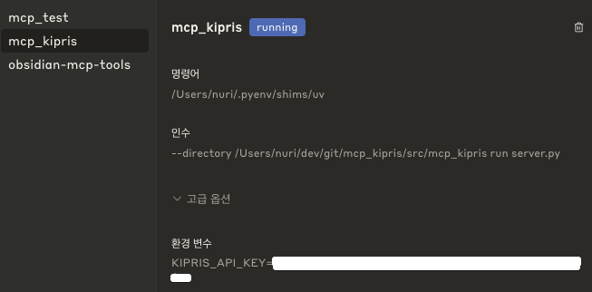

# MCP KIPRIS

KIPRIS(한국특허정보원) API를 활용한 특허 검색 도구입니다.

## 기능

### 한국 특허 검색
1. 출원인 검색 (PatentApplicantSearchTool)
   - 출원인 이름으로 특허 검색
   - 정렬 및 필터링 옵션 지원

2. 키워드 검색 (PatentFreeSearchTool)
   - 자유 텍스트로 특허 검색
   - 정렬 및 필터링 옵션 지원

3. 출원번호 검색 (PatentApplicationNumberSearchTool)
   - 출원번호로 특허 검색
   - 상세 정보 조회 가능

4. 권리자 검색 (PatentRighterSearchTool)
   - 권리자 이름으로 특허 검색
   - 정렬 및 필터링 옵션 지원

5. 특허 상세 정보 검색 (PatentDetailSearchTool)
   - 출원번호로 특허의 상세 정보 조회

6. 특허 요약 정보 검색 (PatentSummarySearchTool)
   - 출원번호로 특허의 요약 정보 조회

### 해외 특허 검색
1. 출원인 검색 (ForeignPatentApplicantSearchTool)
   - 출원인 이름으로 해외 특허 검색
   - 국가별 검색 지원

2. 출원번호 검색 (ForeignPatentApplicationNumberSearchTool)
   - 출원번호로 해외 특허 검색
   - 국가별 검색 지원

3. 키워드 검색 (ForeignPatentFreeSearchTool)
   - 자유 텍스트로 해외 특허 검색
   - 국가별 검색 지원

4. 국제출원번호 검색 (ForeignPatentInternationalApplicationNumberSearchTool)
   - 국제출원번호로 해외 특허 검색

5. 국제공개번호 검색 (ForeignPatentInternationalOpenNumberSearchTool)
   - 국제공개번호로 해외 특허 검색

## 설치 및 실행

### 환경 설정
1. KIPRIS API 키 설정
```bash
export KIPRIS_API_KEY="your_api_key"
```

2. 의존성 설치
```bash
pip install -r requirements.txt
```

### 실행 방법
1. HTTP 서버 모드
```bash
python -m mcp_kipris.sse_server --http --port 6274 --host 0.0.0.0
```

2. stdio 서버 모드
```bash
python -m mcp_kipris.server
```

## 지원하는 국가 코드
- US: 미국
- EP: 유럽
- WO: PCT
- JP: 일본
- PJ: 일본영문초록
- CP: 중국
- CN: 중국특허영문초록
- TW: 대만영문초록
- RU: 러시아
- CO: 콜롬비아
- SE: 스웨덴
- ES: 스페인
- IL: 이스라엘

## 정렬 옵션
- PD: 공고일자
- AD: 출원일자
- GD: 등록일자
- OPD: 공개일자
- FD: 국제출원일자
- FOD: 국제공개일자
- RD: 우선권주장일자

## 특허 상태 코드
- A: 공개
- C: 정정공개
- F: 공고
- G: 정정공고
- I: 무효공고
- J: 취소공고
- R: 재공고

## Claude 설정

 Claude를 사용하기 위한 설정은 다음과 같습니다:



## 설치 방법

1. Python 3.12 이상이 필요합니다.
2. 가상환경을 생성하고 활성화합니다:
```bash
python -m venv .venv
source .venv/bin/activate  # Linux/Mac
# 또는
.venv\Scripts\activate  # Windows
```

3. 프로젝트를 설치합니다:
```bash
pip install -e .
```

## API 사용 예제

### SSE 연결 설정

1. SSE 연결 및 세션 ID 받기:
```bash
curl -N http://localhost:6274/messages/
```

응답 예시:
```
event: endpoint
data: /messages/?session_id=<세션_ID>
```

### 도구 목록 조회

```bash
curl http://localhost:6274/tools | jq .
```

### 특허 검색 예제

1. 출원인 검색 (삼성전자의 최근 특허 5건):
```bash
curl -X POST "http://localhost:6274/messages/?session_id=<세션_ID>" \
  -H "Content-Type: application/json" \
  -d '{
    "type": "tool",
    "name": "patent_applicant_search",
    "args": {
      "applicant": "삼성전자",
      "docs_count": 5,
      "desc_sort": true
    }
  }'
```

## 지원하는 도구 목록

1. 한국 특허 검색:
   - `patent_applicant_search`: 출원인 기준 검색
   - `patent_keyword_search`: 키워드 기준 검색
   - `patent_search`: 출원번호로 검색
   - `patent_righter_search`: 권리자 기준 검색
   - `patent_application_number_search`: 출원번호로 검색
   - `patent_summary_search`: 출원번호로 요약 정보 검색
   - `patent_detail_search`: 출원번호로 상세 정보 검색

2. 해외 특허 검색:
   - `foreign_patent_applicant_search`: 출원인 기준 검색
   - `foreign_patent_application_number_search`: 출원번호로 검색
   - `foreign_patent_free_search`: 자유 텍스트 검색
   - `foreign_patent_international_application_number_search`: 국제출원번호로 검색
   - `foreign_patent_international_open_number_search`: 국제공개번호로 검색

## 응답 형식

모든 API 응답은 JSON 형식으로 반환되며, 다음과 같은 구조를 가집니다:

```json
[
  {
    "type": "text",
    "text": "검색 결과 텍스트",
    "metadata": null
  }
]
```

## 로깅

서버는 기본적으로 DEBUG 레벨의 로깅을 제공합니다. 로그에서 다음과 같은 정보를 확인할 수 있습니다:
- 도구 호출 시작/완료 시간
- 도구 실행 소요 시간
- 오류 발생 시 상세 정보

## 라이선스

MIT License

## 기여하기

1. Fork the Project
2. Create your Feature Branch (`git checkout -b feature/AmazingFeature`)
3. Commit your Changes (`git commit -m 'Add some AmazingFeature'`)
4. Push to the Branch (`git push origin feature/AmazingFeature`)
5. Open a Pull Request
